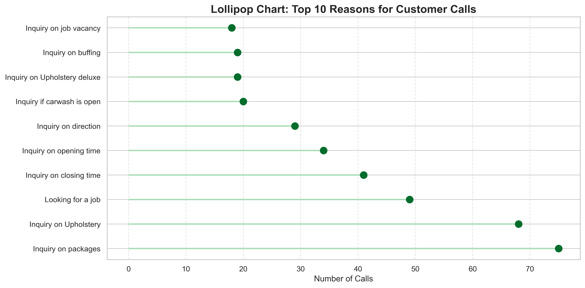
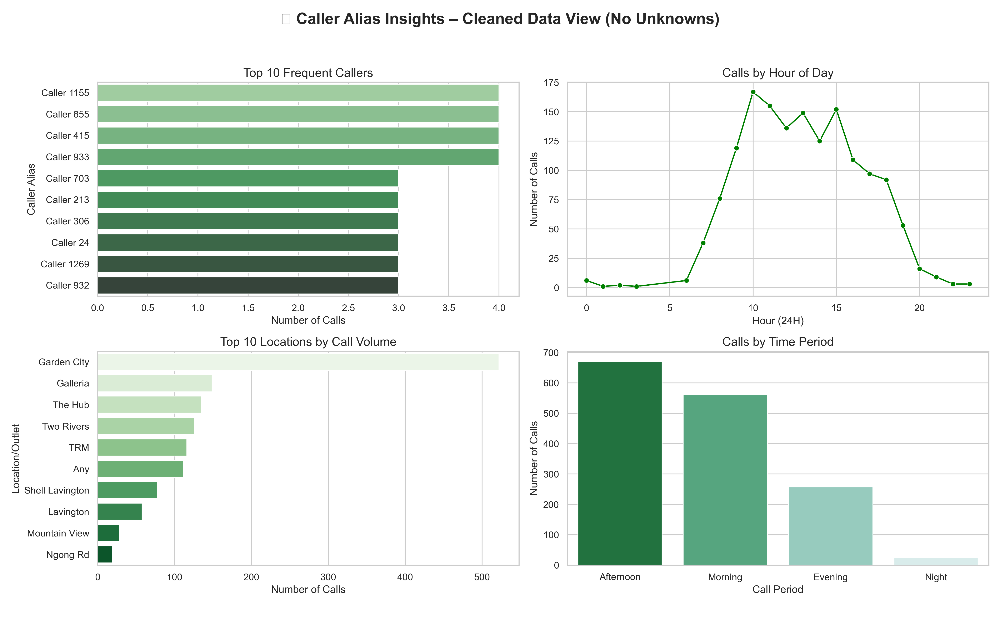
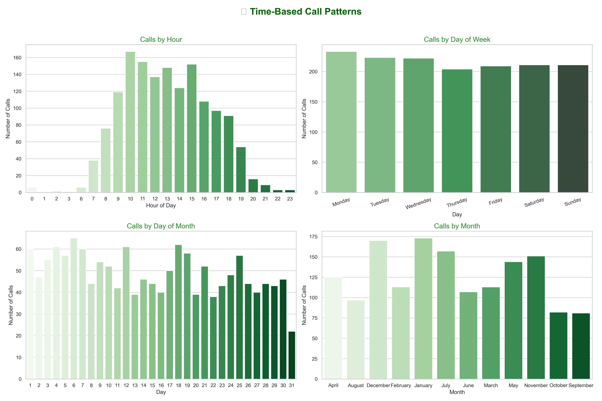
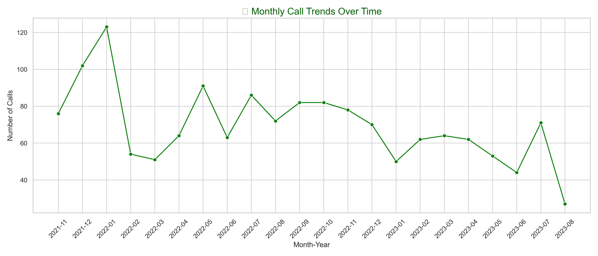
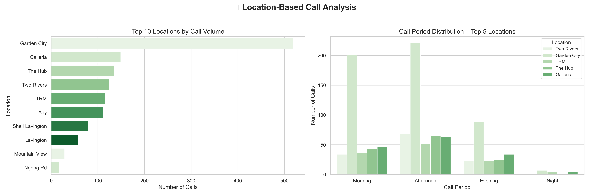
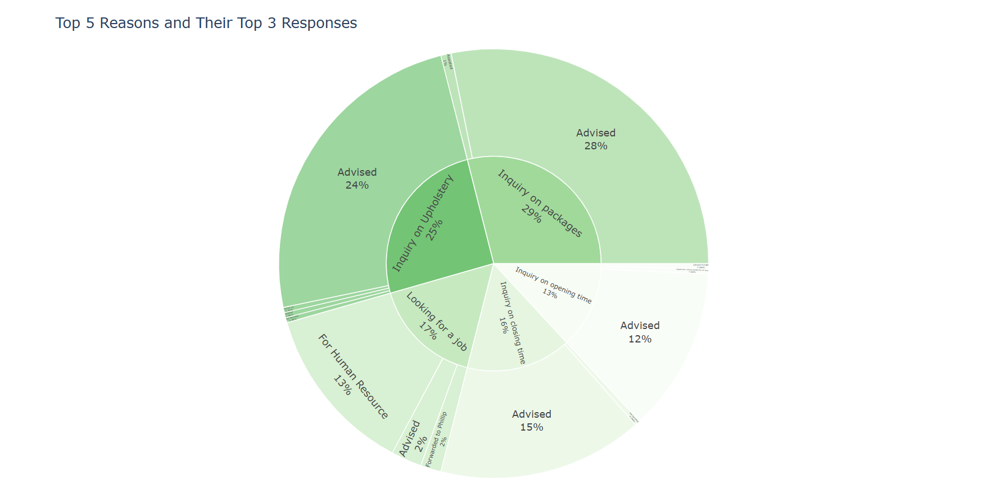

# 📞 Premium Carwash Customer Care Call Analysis


**Author: Rachel Odhiambo**

## 🧠 Introduction

This project delivers a comprehensive analysis of customer service call records from a **busy, premium 10-branch carwash business** that served hundreds of customers weekly. As the **customer care representative**, I personally received and documented each call through the official **toll-free line**, maintained monthly logs, and later structured this data for analytical purposes.
Our toll-free customer care line handled everything from inquiries, bookings and service follow-ups to urgent complaints — reflecting the high expectations of our loyal, quality-conscious clientele.

Despite this daily volume of interactions, much of the service data remained unstructured and underutilized. This analysis transforms **two years of manually documented call records** into clear, actionable business insights — helping inform staffing, improve service delivery, and support smarter branch-level decisions.

---

## 🚨 Business Problem

Customer care centers are crucial touchpoints — but often lack structured feedback loops.

**This project answers:**
- Why are customers calling?
- When and where do most calls occur?
- How are issues resolved across branches?
- What can we learn to support staffing, scheduling, and training?

By addressing these questions, we unlock practical improvements for service delivery and strategic operations.

---

## 🎯 Project Goals

To transform raw call logs into **actionable, data-driven business intelligence**:

- ✅ Identify high-demand periods for effective resource planning
- ✅ Track top reasons for calls and how agents respond
- ✅ Reveal location trends and high-traffic branches
- ✅ Support customer-centric strategies using real-world insights

---

## 👥 Stakeholders & Value

| Stakeholder             | Value Delivered |
|-------------------------|-----------------|
| **Branch Managers**     | Understand local trends & optimize workflows |
| **Customer Care Lead**  | Spot repeat issues, improve response training |
| **Business Owner**      | Make data-backed staffing & investment decisions |
| **Marketing Team**      | Identify pain points to target communications |

---

## 🌍 Real-World Context

This project is based on my **firsthand experience** in customer support for a 10-branch carwash business in Kenya. The call center received **hundreds of calls monthly** — mainly inquiries, follow-ups, complaints, and booking requests.

I manually logged this data during my time in the customer care department. While only a **dummy dataset** is shared publicly, the insights reflect the true nature of service patterns, customer behavior, and operational gaps observed in practice.

---

## 📁 Dataset Overview

| Attribute               | Description |
|------------------------|-------------|
| **Duration**           | Nov 2021 – Aug 2023 |
| **Rows (real data)**   | 2,122 |
| **Dummy Shared File**  | `dummy_customer_care_data.csv` |

### 🔢 Key Columns

| Column Name            | Description |
|------------------------|-------------|
| `DATE`                 | Call date |
| `TIME`                 | Time of day |
| `PHONE`                | Anonymized phone number |
| `CAR REGISTRATION`     | Vehicle plate (optional) |
| `CAR TYPE`             | Vehicle model or notes |
| `REASON FOR CALL`      | Main issue/topic |
| `RESPONSE GIVEN`       | Agent resolution |
| `LOCATION/OUTLET`      | Branch or preferred site |
| `CALL PERIOD`          | Morning, Afternoon, Evening, Night |

---

## ⚠️ Data Protection & Ethics

- ✅ **Anonymized:** All phone numbers and identifiers were encoded
- ✅ **Missing Data:** Many customers declined to share car registration or vehicle model
- ✅ **Dummy Data Shared:** Original dataset not published due to privacy constraints

---

## 🔎 Analysis Approach

1. **Data Cleaning**  
   Standardized time formats, filled missing periods, and anonymized identifiers.

2. **Feature Engineering**  
   Created new time-based features (e.g., Hour, Day of Week, Call Period).

3. **Exploratory Analysis (EDA)**  
   Uncovered patterns by location, time, call reason, and response.

4. **Visual Insights**  
   Static and interactive charts generated using Python libraries.

5. **Insight Extraction**  
   Structured findings into business recommendations.

---

## 📈 Visual Insights

### 🔟 Top 10 Reasons for Customer Calls


### 🍭 Caller Insights
  

### 🍭 Time Based Call Insights
  

### 🍭 Monthly Call Trends
  

### 🍭 Location Based Insights


### 🌞 Sunburst: Reasons → Responses
 


---

## 📅 Key Patterns Uncovered

### 🕐 Time-Based Trends

| Time Dimension | Insight |
|----------------|---------|
| **Hour**       | Peak calls: 10 AM – 3 PM |
| **Day**        | Most active: Mon, Wed, Fri |
| **Month**      | Volume spikes: Jan, Jul, Dec |

### 🏢 Location Trends

- Top Branches: Garden City, Galleria, The Hub, Two Rivers, TRM
- Many customers selected “Any” location → shows flexibility in preference

### 📞 Common Reasons for Calling

- **#1 Reason:** “CALL FOR SERVICE” dominates
- Followed by:
  - “INQUIRY AND BOOKING”
  - “FOLLOW UP”
  - “CALL TO FIND OUT IF CAR IS READY”

---

## 💼 Business Recommendations

1. **Staff Allocation:** Reinforce support from 10 AM – 3 PM, especially Mon/Wed/Fri.
2. **Training Focus:** Prep agents for high-frequency queries (bookings, follow-ups).
3. **Digital Reminders:** Use SMS/WhatsApp to reduce repetitive "Is my car ready?" calls.
4. **Branch Planning:** Garden City and Galleria need resource scaling.
5. **Customer Loyalty:** Monitor frequent callers for service recovery or loyalty program engagement.

---

## 🧰 Tools & Technologies

- **Python** – analysis and automation
- **Pandas & NumPy** – data manipulation
- **Matplotlib, Plotly, Seaborn** – advanced visualizations
- **Jupyter Notebook** – interactive documentation
- **VS Code** – development environment
- **Excel** – original data capture
- **Git + GitHub** – version control

---

## 📂 File Structure

```bash
📦 Toll-Free Customer Care Analysis
├── Output/
│   ├── *.png, *.jpg, *.html  # Visuals
├── anonymized_customer_care_data.csv
├── cleaned_customer_data.csv
├── dummy_customer_care_data.csv
├── private_phone_mapping.csv
├── CustomerTollFreeData.xlsx
├── customer_call_analysis.ipynb
├── caller_dashboard.py
├── README.md
├── .gitignore
```

## 🤝 Let's Connect & Collaborate!

Thanks for checking out this project!  
I’m always excited to connect, collaborate, or chat about data, analytics, and impactful opportunities in tech 🚀

- 🔗 **LinkedIn** → [Rachel Odhiambo](https://www.linkedin.com/in/rachelodhiambo)
- 📬 **Email** → rakothodhiambo@gmail.com

> *“Alone we can do so little; together we can do so much.” – Helen Keller*


## 🚀 How to Run Locally

**Recommended**: Python 3.8+, Jupyter Notebook

### 🔁 Clone the Repository

```bash
git clone https://github.com/yourusername/customer-care-call-analysis.git
cd customer-care-call-analysis
```

If you found this project useful, insightful, or inspiring — feel free to star ⭐ the repo or fork it! 🛠️ Questions, feedback, or ideas? Open an issue or reach out via LinkedIn or Email.