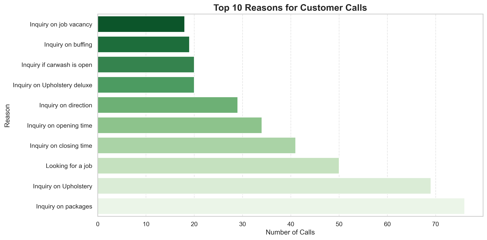

# 📞 Carwash Customer Care Call Analysis

## 🧠 Introduction

This project provides an in-depth analysis of real-world customer care data collected from a multi-branch carwash business in Kenya. As the **customer care representative**, I personally handled calls through the **toll-free customer service line**, recorded details, and organized the monthly reports used in this analysis.

---

## 🚨 Business Problem

Customer care teams are the frontline of service operations — yet many businesses fail to leverage the insights from these interactions.

This project addresses key questions:
- Why are customers calling?
- How are their issues being resolved?
- Which branches handle the most queries?
- Are there trends in timing or query type?

---

## 📌 Project Overview

**Goal**: To help management optimize operations, staffing, and customer experience by turning call center data into actionable insights.

**Key Questions Answered:**
- 📆 When do customers call the most?
- ❓ What are the most common reasons for calls?
- 🔁 How are different issues typically resolved?
- 🏢 Which branches get the most interaction?

---

## 📊 Business Value

This analysis offers direct value to carwash operations and leadership teams:
- **Optimize staff allocation** by understanding peak call hours.
- **Improve response quality** through common reason-response mapping.
- **Identify underperforming branches** based on call patterns.
- **Track service issues** through repeat call topics and escalations.

---

## 🧰 Tools Used

- **Python** – pandas, matplotlib, seaborn, plotly
- **Jupyter Notebook**
- **Excel** – for raw call logs
- **HTML Visuals** – interactive charts (sunburst & sankey)

---

## 👥 Stakeholders & How They Benefit

| Stakeholder       | Benefit |
|-------------------|---------|
| Branch Managers   | Identify top service issues per branch |
| Customer Care Lead| Spot bottlenecks in issue resolution |
| Business Owner    | Optimize staffing and training based on call trends |
| Marketing Team    | Understand customer pain points for targeting |

---

## 📁 About the Data

This dataset was created from actual call logs while I worked as a **customer care rep** at a large carwash business with **10 branches**.

| Column              | Description                              |
|---------------------|------------------------------------------|
| `date`              | Date of customer call                    |
| `time`              | Time of the call                         |
| `phone`             | Customer phone number                    |
| `car_registration`  | Vehicle plate number                     |
| `car_type`          | Type/model of car                        |
| `reason`            | Reason for calling                       |
| `branch`            | Branch receiving the call                |
| `response`          | What was communicated/resolved           |

All calls were received through the official **customer toll-free line**.

---

## 📊 Visual Analysis & Insights

### 🔟 Top 10 Reasons for Customer Calls

### 🔁 Top 10 Responses Given by Agents

---

### 📍 Lollipop Charts – Creative View

**Top Reasons**

**Top Responses**

---

### 🌞 Sunburst Chart: Reason → Response
[View Interactive Sunburst](Output/simplified_sunburst.html)

### 🔄 Sankey Diagram: Reason → Response
[View Interactive Sankey](Output/simplified_sankey.html)

---

## 💡 Insights

- Calls peaked during **late mornings (10 AM - 12 PM)** — suggesting ideal time for agent allocation.
- Most calls centered around **booking issues**, **service delays**, and **follow-ups**.
- Certain branches (e.g., *Westlands* and *CBD*) experienced consistently high call volumes.
- **Majority of issues** were resolved through brief reassurances or booking confirmations.

---

## 🎯 Future Enhancements

- Segment analysis by **branch** and **location**
- Add **weekly/monthly call trends**
- Create a **dashboard** using Streamlit or Tableau
- Apply **sentiment/keyword analysis** on call notes

---

## 📂 Project Files

| File Name                          | Description |
|-----------------------------------|-------------|
| `carwash_calls.xlsx`              | Raw call log from Excel (monthly sheets) |
| `cleaned_carwash_calls.csv`       | Cleaned data for reporting/dashboard use |
| `carwash_call_analysis.ipynb`     | Main Jupyter notebook with code + visuals |
| `Output/`                         | Folder with saved visuals and HTML charts |

---

## 📌 Summary for Recruiters

As a hands-on customer care agent, I collected and analyzed real customer interaction data from a business context I directly worked in. This project reflects:
- **Data collection + cleaning** from scratch
- **Business-oriented thinking**
- **Effective communication through visuals**
- **Use of Python for real-world problem solving**

---

## 🙋‍♀️ About Me

**Name:** Rachel Odhiambo  
**Role:** Data Scientist  
**Background:** Customer care lead for 10-branch carwash  
**Location:** Kenya  

---

> ✅ If you're a recruiter or hiring manager, this project shows not only technical skill but also my ability to extract insights from real-world, messy data — and communicate results clearly to non-technical stakeholders.
